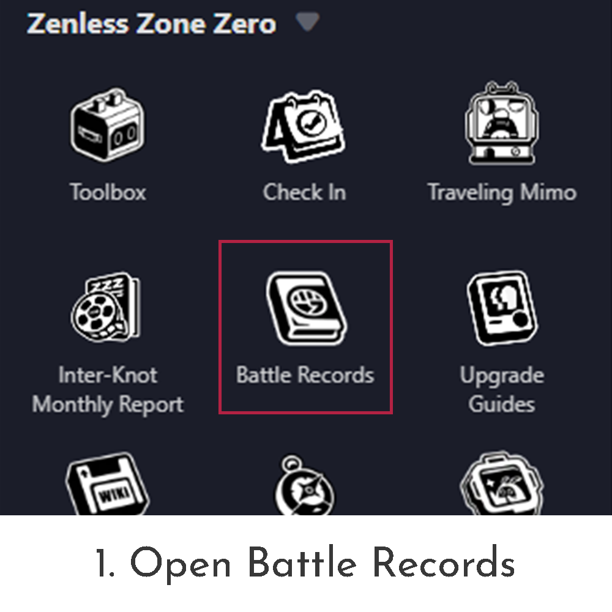
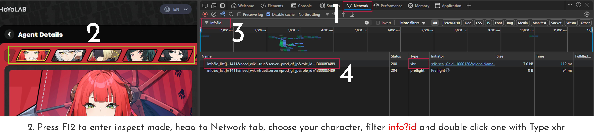
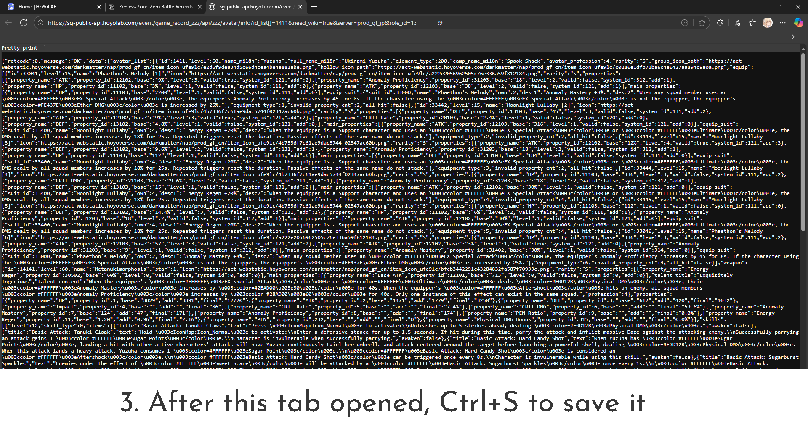
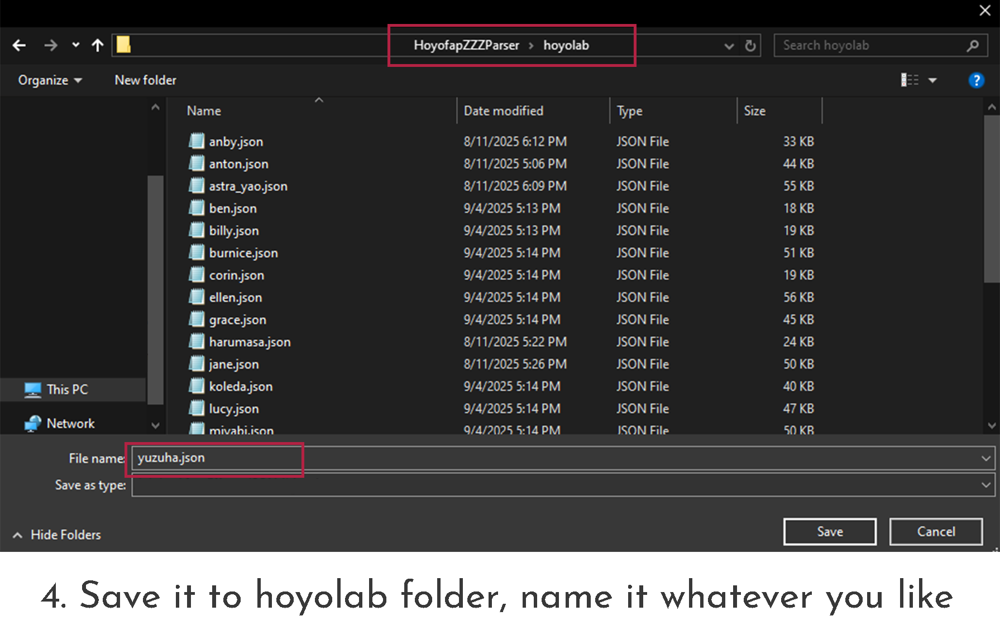

# HoyofapZZZParser

A software written in Zig to parse equipments from official account through Hoyolab
Create gameplay_settings.zon for [Yidhari-ZS](https://git.xeondev.com/yidhari-zs/Yidhari-ZS)   

## How to use
Save all your json files from Hoyolab to `hoyolab` folder.
Run parser and it will generate gameplay_settings.zon 

## How to get Hoyofap json

